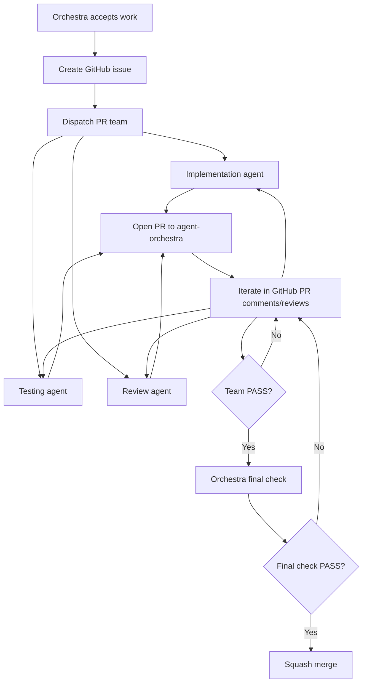

# Agent Operating Guide

This guide captures the operating rules for running a Claude Code/Fable agent team on this repository. Keep it short, explicit, and easy for an orchestra agent to follow.

## Branch Rules

- `main` is the stable branch. Do not implement directly on `main`.
- Long-running agent work happens on `agent-orchestra`.
- Implementation PRs target `agent-orchestra`, not `main`.
- Use squash merge only.
- Before editing, merging, or opening a PR, run:

```sh
pwd && git branch --show-current
```

If the branch is `main`, stop and switch to the correct working branch.

## Ticket Workflow

Every accepted unit of work should start as a GitHub issue. The orchestra assigns that issue to a small PR team: implementation, testing, and review. The team iterates in one PR, with all findings, fixes, test results, screenshots, and decisions recorded in GitHub PR comments or reviews so humans can read the full history.



## Orchestra Agent

The orchestra agent coordinates the run. It should:

- Create a GitHub issue for each accepted ticket before dispatch.
- Maintain an orchestration ledger with issues, owners, branches, PRs, checks, verdicts, and merge results.
- Deduplicate findings before assigning implementation work.
- Reject vague, low-value, duplicate, or out-of-scope findings with a short reason.
- Dispatch a coordinated implementation, testing, and review agent team for each issue.
- Keep implementation work out of the main checkout.
- Require the PR team to iterate in GitHub PR comments or reviews.
- Run a final orchestra check before merge.
- Squash merge accepted PRs into `agent-orchestra`.

The orchestra should not make product code changes itself except for explicit orchestration or emergency repair work.

## Implementation Agents

Each implementation agent should:

- Work from the latest `origin/agent-orchestra`.
- Create its own branch and worktree.
- Create its own environment inside that worktree, including dependencies, local env files, dev server ports, and browser profiles when needed.
- Keep each PR tightly scoped to an accepted ticket.
- Link the GitHub issue in the PR body.
- Include a PR body with problem, solution, tests run, and risk.
- Run relevant targeted tests plus the standard checks:

```sh
npm test
npm run lint
npm run build
```

- Avoid lockfile changes unless the ticket specifically requires them.
- Rebase or recreate from the latest `origin/agent-orchestra` when the base branch moves.

## Testing Agents

Each ticket should have a testing agent between implementation and review. Testing agents should:

- Work in their own worktree and environment, separate from the implementation agent.
- Pull the implementation branch or PR branch under test.
- Reproduce the ticket acceptance criteria from a clean checkout.
- Run the relevant targeted tests and standard checks.
- Add or request missing regression coverage when the implementation does not prove the fix.
- Post a GitHub comment with test plan, commands, results, failures, and artifact links.
- Send failures back to the implementation agent in the PR conversation for another iteration before review.

Testing agents should not merge PRs. They should make the reviewer's job smaller by confirming whether the implementation is behaviorally and test-wise ready.

## Review Agents

Each PR should have a reviewing agent. Review agents should:

- Inspect the PR diff and stated acceptance criteria.
- Run or verify the relevant checks.
- Post review results as GitHub comments so the conversation is visible.
- Use PASS, ISSUES, or UNVERIFIED verdicts.
- Include expected vs observed behavior for every issue.
- Include links to logs, screenshots, probes, and command output.

When a review finds a real issue, the orchestra should create or assign a follow-up implementation ticket. The fix should land in a new PR targeting `agent-orchestra`.

## Artifacts

Artifacts that need to be discussed on GitHub should be pushed to the repository instead of living only in a local temp directory.

- Store PR artifacts under:

```txt
assets/pr-<number>/
```

- Commit the artifacts to the PR branch that produced them.
- Use small, curated artifacts: screenshots, short logs, probe JSON, or concise markdown summaries.
- For inline screenshots in GitHub comments, use a raw GitHub URL pinned to the artifact commit SHA when possible:

```md

```

- For text artifacts, link to the GitHub blob URL for the same commit.
- If the PR number does not exist yet, open a draft PR early or stage artifacts under a ticket-named directory and rename it to `assets/pr-<number>/` before posting final comments.

## Visual Review Protocol

UI, rendering, browser, accessibility, scrolling, theming, or demo changes need real browser evidence.

Visual review agents should:

- Use their own worktree.
- Use their own local dev server port.
- Use their own browser process, context, or profile.
- Save and push review artifacts under `assets/pr-<number>/`.
- Capture screenshots, console logs, network notes when relevant, and DOM/probe outputs.
- Post a GitHub comment with setup, steps, observations, verdict, and artifact links. Render screenshots inline when useful.

Agents should not serialize all browser work through one shared browser lock. Independent PR teams should be able to inspect frontends concurrently.

## Smoke Review Protocol

Some PRs have no UI surface, such as formatting, packaging, tests, CI, or benchmark changes. These still need a GitHub-visible review comment.

Smoke review comments should state:

- Why there is no visual surface.
- Which commands or probes were run.
- The result of each check.
- Any artifact links.
- PASS, ISSUES, or UNVERIFIED verdict.

## GitHub Comments

GitHub should be the visible conversation record between review and implementation agents.

- Issue links should appear in the PR body.
- Review findings go on the original PR.
- Test results go on the PR before review sign-off.
- Implementation responses and follow-up commits should answer findings in the PR conversation.
- Follow-up fixes should link back to the finding that caused them.
- Final status comments should link the follow-up PR and state whether the issue was resolved.

## Completion Gate

An orchestra run is done only when:

- Every accepted ticket is merged into `agent-orchestra` or rejected with evidence.
- No PRs targeting `agent-orchestra` remain open unless explicitly documented as blocked or out of scope.
- Every accepted ticket has a linked GitHub issue.
- Every merged PR has a visual review, visual re-review, or smoke review comment.
- `agent-orchestra` is synced with `origin/agent-orchestra`.
- Fresh final checks pass on `agent-orchestra`:

```sh
npm test
npm run lint
npm run build
```

- The final report summarizes merged PRs, rejected findings, follow-up fixes, remaining risks, and how to compare `agent-orchestra` with `main`.

## Practical Notes

- Prefer small, well-scoped PRs over broad bundles.
- Keep unrelated refactors out of implementation tickets.
- Treat tool backpressure as a signal to reduce concurrency, not to abandon the run.
- Keep local artifact directories out of commits unless they are curated under `assets/pr-<number>/`.
- Do not delete other active Claude sessions, proxy processes, or user-owned work without explicit instruction.
